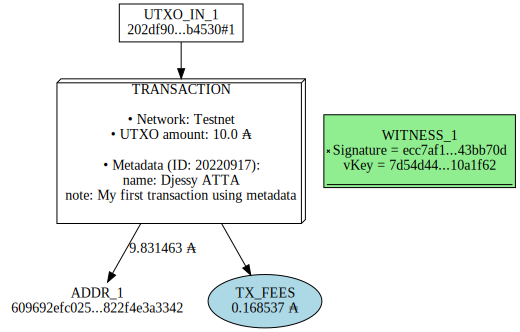

# Cardano Transaction Tools 

<br />

**Table of contents**
- [Install](#Install)
- [Transaction Vizualisation](#Transaction-Vizualisation)

<br />


## Install

```python
pip install cardano_py_tools 
```

## Transaction Vizualisation

```python
from IPython.display import SVG
from cardano_py_tools import transaction as tx

TX_FILE="tests/tx-files/txMetadata.signed"
SAVE_TO="tests/flow-chart/txMetadata.svg"

tx.vizualisation(txFile=TX_FILE, saveTo=SAVE_TO)

SVG(SAVE_TO)
```


